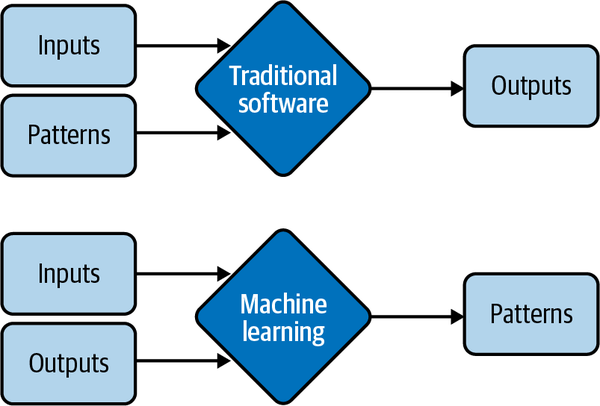
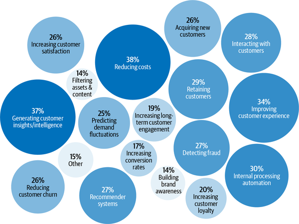
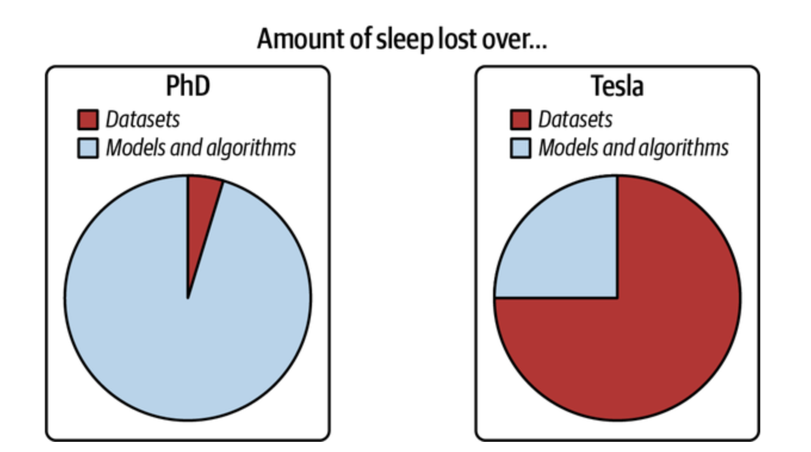

# Overview of Machine Learning Systems

## High level overview of chapter
Ok.

Quickly.

When I tell you 'machine learning system', what do you think of?

Well, most people (like me when I was reading this book) automatically connects with specific ML algorithms that can be used such as:
- Logistic regression
- Neural nets

However.

Algorithm is only a small part of ML system in production!

Just to name a few, other critical aspects of the system would also be:
1. business requirements, that gave birth to the ML project in the first place
2. interface where users and developers interact with system
3. data stack
4. logic for developing, monitoring, and updating models
5. infrasstructure that enables the delivery of said logic

## Key Takeaway
1. While it’s important to pursue pure research, most companies can’t afford it unless it leads to short-term business applications. This is especially true now that the research community took the “bigger, better” approach.
    - The vast majority of ML-related jobs will be, and already are, in productionizing ML.

## Structure of chapter 1
The first chapter of the book aims to give you an overview of what it takes to bring an ML model to production

This chapter addresses the following: 
1. address the fundamental question of when and when not to use ML
2. discuss the challenges of deploying ML systems
3. compare ML in research vs traditional software

## When to use/not use machine learning

### What question to ask prior starting ML project?
The first thing that you need to get into your head is this: **ML IS NOT A MAGIC TOOL THAT CAN SOLVE ALL PROBLEMS**

In fact, even for problems where ML can solve, ML solutions might not be the optimal solution.

Hence, something important for you to do before starting an ML project is to ask:
> :question: **_Question_** Whether ML is necessary or cost-effective

### What ML can do?
The following quote taken from the book summarizes it pretty well
> :memo: **_Quote_** Machine learning is an approach to (1) learn (2) complex patterns from (3) existing data and use these patterns to make (4) predictions on (5) unseen data.

Diving into more details on each one of them:

**1. Learn: the system has the capacity to learn** 
In most cases, ML systems learn from data.

Now, just to illustrate an example of what is NOT an ML system, consider a relational database. 
A relational database isn’t an ML system because it doesn’t have the capacity to learn. You can explicitly state the relationship between two columns in a relational database, but it’s unlikely to have the capacity to figure out the relationship between these two columns by itself.

**2. Complex patterns: there are patterns to learn, and they are complex** 
ML solutions are only useful when there are patterns to learn.

**A situation of when NOT to use ML because of a lack of pattern -> Rolling a dice**
- sane people don’t invest money into building an ML system to predict the next outcome of a fair die because there’s no pattern in how these outcomes are generated.

**A situation of when ML could work -> predicting stock prices based on patterns**
- There are patterns in how stocks are priced, and therefore companies have invested billions of dollars in building ML systems to learn those patterns.

Whether a pattern exists might not be obvious, or if patterns exist, your dataset or ML algorithms might not be sufficient to capture them. 
- For example, there might be a pattern in how Elon Musk’s tweets affect cryptocurrency prices. However, you wouldn’t know until you’ve rigorously trained and evaluated your ML models on his tweets. Even if all your models fail to make reasonable predictions of cryptocurrency prices, it doesn’t mean there’s no pattern.

**A situation of when non-ML would work -> predicting stock prices based on patterns**
- Consider a website like Airbnb with a lot of house listings; each listing comes with a zip code. 
    - If you want to sort listings into the states they are located in, you wouldn’t need an ML system. Since the pattern is simple—each zip code corresponds to a known state—you can just use a lookup table.

**Fundamental Difference Between Traditional Software and Machine Learning**
Perhaps, the most obvious difference between traditional software and that of machine learning is that instead of requiring hand-specified patterns to calculate outputs, ML solutions learn patterns from inputs and outputs.
This is illustrated in this figure

**3. Existing data: data is available, or it’s possible to collect data** 

Now, there are three types of learning possible and each depends on a different type/amount of data:

1. Zero Shot learning (few-shot learning)
    - Here, it’s possible for an ML system to make good predictions for a task without having been trained on data for that task. 
    - However, this ML system was previously trained on data for other tasks, often related to the task in consideration.
2. Continual Learning
    - Here, we launch mL system without data
    - They will learn from incoming data in production
    - However, serving insufficiently trained models to users comes with certain risks, such as poor customer experience.
3. Fake-it-til-you-make-it
    - many companies follow a “fake-it-til-you make it” approach: launching a product that serves predictions made by humans, instead of ML models, with the hope of using the generated data to train ML models later.

**4. Predictions: it’s a predictive problem** 
- ML models make predictions, so they can only solve problems that require predictive answers

> :bulb: **NOTE** Whatever question you might have, you can always frame it as: “What would the answer to this question be?” regardless of whether this question is about something in the future, the present, or even the past.

Compute-intensive problems are one class of problems that have been very successfully reframed as predictive. Instead of computing the exact outcome of a process, which might be even more computationally costly and time-consuming than ML, you can frame the problem as: “What would the outcome of this process look like?” and approximate it using an ML model. The output will be an approximation of the exact output, but often, it’s good enough. You can see a lot of it in graphic renderings, such as image denoising and screen-space shading.

**5. Unseen data: unseen data shares patterns with the training data** 
- In technical terms, it means your unseen data and training data should come from similar distributions.

### In what tasks do ML excel at?
Due to the way most ML algorithms today learn, ML solutions will especially shine if your problem has these additional following characteristics:

1. HIGHLY REPETITIVE!

2. Cost of wrong predictions is relatively low
    - ML is especially suitable when the cost of a wrong prediction is low.
    - If one prediction mistake can have catastrophic consequences, ML might still be a suitable solution if, on average, the benefits of correct predictions outweigh the cost of wrong predictions
        - Consider self-driving cars as an example

3. It’s at scale
    - “At scale” means different things for different tasks, but, in general, it means making a lot of predictions.
    - ML solutions often require nontrivial up-front investment on data, compute, infrastructure, and talent, so it’d make sense if we can use these solutions a lot.

4. The patterns are constantly changing
    - Figuring how your problem has changed so that you can update your handwritten rules accordingly can be too expensive or impossible. Because ML learns from data, you can update your ML model with new data without having to figure out how the data has changed.

### In what tasks should I avoid ML?
Most of today’s ML algorithms shouldn’t be used under any of the following conditions:

- It’s unethical. 

- Simpler solutions do the trick. 

- It’s not cost-effective.

Now, even if ML can’t solve your problem, it might be possible to break your problem into smaller components, and use ML to solve some of them.

## Typical ML use Cases

### Consumer vs Entreprise Focus in ML

As of 2022, the date that this book is written, even though the market for consumer ML applications is booming, the majority of ML use cases are still in the enterprise world.

Now, 

> :bulb: **NOTE** Enterprise ML applications tend to have vastly different requirements and considerations from consumer applications.

|                        | Entreprise    | Consumer      |
| -----------            | -----------   | ------------  |
| Latency Requirement    | Low Emphasis  |  High Emphasis|
| Accuracy Requirement   | High Emphasis | Low Emphasis  |

For most cases, enterprise applications might have stricter accuracy requirements but be more forgiving with latency requirements

At the same time, latency of a second might get a consumer distracted and opening something else, but enterprise users might be more tolerant of high latency.

### Entreprise use case

According to Algorithmia’s 2020 state of enterprise machine learning survey, ML applications in enterprises are diverse, serving both internal use cases (reducing costs, generating customer insights and intelligence, internal processing automation) and external use cases (improving customer experience, retaining customers, interacting with customers) as shown in this figure below

## Understanding ML Systems

Here, the book goes into the difference between ML in research and ML in industry. 

### Machine learning in reserach vs production

ML in production is very different from ML in research. The table below shows five of the major differences.

|              | Production    | Research      |
| -----------  | -----------   | ------------  |
| Requirements |    State-of-the-art model performance on benchmark datasets    |   Different stakeholders have different requirements    |
|    Computational Priority    |    Fast training, high throughput    |    Fast inference, low latency   |
|    Data    |    Static    |    Constantly shifting    |
|   Fairness    |    Often not a focus    |    Must be considered    |
|    Interpretability    |    Often not a focus    |    Must be considered    |

### Understanding different stakeholders and requirements

Coming from a research background, the goal is often simple: develop a model that achieves the state-of-the-art results on benchmark datasets

Things changes when it comes to industry as we will have to consider the requirements from each individual stakeholders

To get things into perspective, consider a mobile app that recommends restaurants to users, here the app makes money by charging restaurants a 10% service fee on each order.

| Stakeholders Position | Main Concern   | 
| -----------  | -----------   | 
| ML Engineer | Want a model that recommends restaurants that users will most likely order from, and they believe they can do so by using a more complex model with more data. |
| Sales Team | Wants a model that recommends the more expensive restaurants since these restaurants bring in more service fees. |
| Product Team | Notices that every increase in latency leads to a drop in orders through the service, so they want a model that can return the recommended restaurants in less than 100 milliseconds. |
| ML Platform Team |  As the traffic grows, this team has been woken up in the middle of the night because of problems with scaling their existing system, so they want to hold off on model updates to prioritize improving the ML platform. |
| Manager |  Wants to maximize the margin, and one way to achieve this might be to let go of the ML team. |

> :bulb: **NOTE** A simple rule in industry is: if a simple model can do a reasonable job, complex models must perform significantly better to justify the complexity.

### Computation priorities

Another contrast between research and production is that research usually prioritizes fast training, whereas production usually prioritizes fast inference.

From that, we derive an important corollary:
> :memo: **_Quote_** Research prioritizes high throughput whereas production prioritizes low latency.
Here:
- latency refers to the time it takes from receiving a query to returning the result
- throughput refers to how many queries are processed within a specific period of time.
For example, the average latency of Google Translate is the average time it takes from when a user clicks Translate to when the translation is shown, and the throughput is how many queries it processes and serves a second.

### Data

**Clean vs Messy Data**

During the research phase, the datasets you work with are often clean and well-formatted, freeing you to focus on developing models.
In production, data, if available, is a lot more messy.

**Historical vs Constantly Changing Data**

In research, you mostly work with historical data, e.g., data that already exists and is stored somewhere. 
In production, most likely you’ll also have to work with data that is being constantly generated by users, systems, and third-party data.

All in all, the situation with data can best be summarized with the following figure by Andrej Karpathy.

### Intreprebility

Since most ML research is still evaluated on a single objective, model performance, researchers aren’t incentivized to work on model interpretability. 
However, interpretability isn’t just optional for most ML use cases in the industry, but a requirement.
1. First, interpretability is important for users, both business leaders and end users, to understand why a decision is made so that they can trust a model and detect potential biases mentioned previously.
2. Second, it’s important for developers to be able to debug and improve a model.

## Machine Learning System vs Traditional Software

In SWE, there’s an underlying assumption that code and data are separated.

On the contrary, ML systems are part code, part data, and part artifacts created from the two. The trend in the last decade shows that applications developed with the most/best data win.
- Instead of focusing on improving ML algorithms, most companies will focus on improving their data.

In traditional SWE, you only need to focus on testing and versioning your code. With ML, we have to test and version our data too, and that’s the hard part.