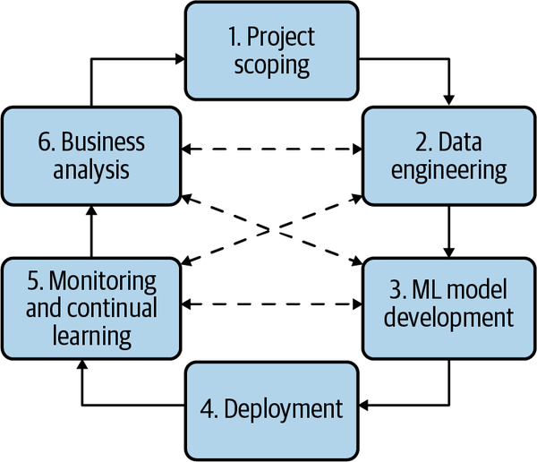

# Introduction to Machine Learning Systems Design

## High Level Overview of the Chapter

Re-iterating from the first chapter, ML systems design takes a system appraoch to MLOps
>:bulb: MLOps is an ML culture and practice that unifies ML application development (Dev) with ML system deployment and operations (Ops).

In general, there are four requirements that guide the developement of the ML system:
1. Reliability
2. Scalability
3. Maintainability
4. Adaptability

Now, before designing a ML algorithm to solve a problem, the primary important thing is to **frame the problem into a task that ML can solve**. This will be talked in this chapter

Lastly, the last part of this chapter touches on a debate that has consumed much of the ML literature in recent years: which is more important—data or intelligent algorithms?

## Key Takeaways

## Business and ML Objectives

### What is causing short-lived ML projects?
Here is something that needs to be addressed straight out:
>:small_red_triangle_down: most companies don’t care about the fancy ML metrics..... unless it moves some business metrics

A pattern common in many short-lived ML projects is that the data scientists become too focused on hacking ML metrics without paying attention to business metrics

As ML engineers, we should keep in mind that:
- The ultimate goal of any project within a business is **to increase profits**, either directly or indirectly 
For an ML project to succeed within a business organization, it’s crucial to tie the performance of an ML system to the overall business performance. What business performance metrics is the new ML system supposed to influence, e.g., the amount of ads revenue, the number of monthly active users?

## Requirements for ML Systems

### General Requirements

Most successful ML systems need to satisfy the following four requirements (more could be needed):
1. Reliability
2. Scalability
3. Maintainability
4. Adaptability

### Reliability
The system should continue to perform the correct function at the desired level of performance even in the face of adversity (hardware or software faults, and even human error).

Something to note here is:
1. “Correctness” might be difficult to determine for ML systems. For example, your system might call the predict function—e.g., model.predict()—correctly, but the predictions are wrong.
2. Unlike traditional software systems that often gets a runtime error / 404, **ML systems can fail silently**
    - End users don’t even know that the system has failed and might have kept on using it as if it were working.

### Scalability

There are multiple ways an ML system can grow, but just to name a few:
1. Grow in complexity -> simple model growing into 100-million-parameter neural net
2. Grow in traffic volume -> 10, 000 daily prediction request into 10 million daily predictions
3. Grow in ML models count -> first you only had a model to detect trending topics. Then you introduce a second model in that use case to filter out NSFW trending tweets.

Whichever way your system grows, there should be reasonable ways of dealing with that growth.

- When talking about scalability most people think of resource scaling, which consists of up-scaling (expanding the resources to handle growth) and down-scaling (reducing the resources when not needed).
- Resource scaling is not the only concern in scalability; so is artifact management. When you have hundreds of models you need a repeatable and programmatic way to monitor, retrain and deploy a model. You can probably do all these manually if you only have a few.
- The book touches more on the topic of scalability in other sections: Distributed Training, Model Optimisation, Resource Management, Experiment Tracking and Versioning, Development Environment.

### Maintainability

People of very different backgrounds, with very different programming languages and tools, and might own different parts of the process for a ML project. 

Hence, the following need to be emphasized for maintainability of the project:
- Code should be documented
- Code, data, and artifacts should be versioned.
- Models should be sufficiently reproducible so that even when the original authors are not around, other contributors can have sufficient contexts to build on their work. 
- More on this topic in the "Team Structure section in Chapter 11".

### Adaptability
Data distributions and business requirements shift fast. Your system needs to be able to adapt to these natural shifts easily.

## Iterative Process

The main emphasis in this secion is: developing an ML system is an iterative and, in most cases, never-ending process. Once a system is put into production, it’ll need to be continually monitored and updated.

This is best illustrated via figure below. 

The process can be summarized as follows:
1. Step 1: Project Scoping
    - laying out goals, objectives, and constraints
2. Step 2: Data Engineering
    - A vast majority of ML models today learn from data, so developing ML models starts with engineering data.
3. Step 3: ML model developement
    - With the initial set of training data, we’ll need to extract features and develop initial models leveraging these features
4. Deployment:
    - After a model is developed, it needs to be made accessible to users. 
5. Monitoring and continual learning
    - Once in production, models need to be monitored for performance decay and maintained to be adaptive to changing environments and changing requirements
6. Business Analysis
    - Model performance needs to be evaluated against business goals and analyzed to generate business insights

## Framing ML Problems

